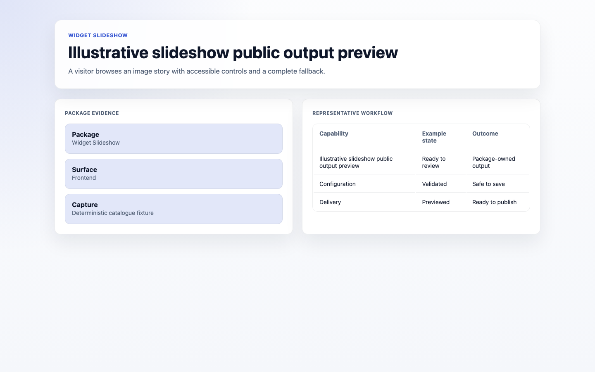
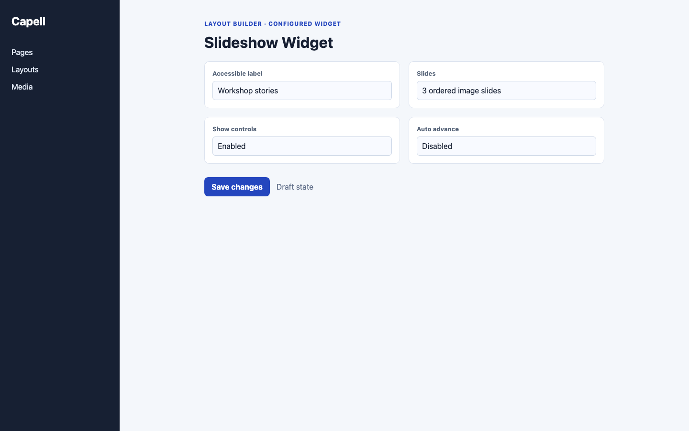

# Slideshow Widget

<!-- prettier-ignore-start -->

## What It Does

Slideshow adds a Layout Builder widget for local responsive images with captions, optional calls to action, and visitor motion controls. It rejects remote media and unsafe URLs before rendering.

- **Price and availability:** Check current availability and price on the [Capell Marketplace listing](https://capell.app/extensions/widget-slideshow).
- **Licence:** Check the licence terms on the [Capell Marketplace listing](https://capell.app/extensions/widget-slideshow).
- **Requires:** `PHP ^8.4`, `capell-app/admin ^1.0`, `capell-app/core ^1.0.66`, `capell-app/frontend ^1.0.2`, `capell-app/layout-builder ^1.0.44`, `spatie/laravel-package-tools ^1.0`.
- **Install:** `composer require capell-app/widget-slideshow`.

Editors assemble slides in Layout Builder, and visitors receive a public image sequence with captions and controls for advancing or pausing motion.

## Who It Is For

**For developers:** The typed extension registers its public assets and validates slide media and links while tests protect the authoring boundary.

**For teams:** Teams can publish an image sequence with useful captions and visitor-controlled motion without commissioning a custom carousel.

## Quick Start

1. Install the package: `composer require capell-app/widget-slideshow`.
2. Open a page, click **Layout builder**, **Add widgets**, then choose **Slideshow**.

## Configure

This extension works without configuration. There is nothing to set after install.

## Limits And Pitfalls

- Install the required Capell packages at the versions in `composer.json`: `capell-app/admin ^1.0`, `capell-app/core ^1.0.66`, `capell-app/frontend ^1.0.2`, `capell-app/layout-builder ^1.0.44`.
- Keep public Blade and cached HTML free of authoring markers, model IDs, permissions, signed editor URLs, and lazy database queries.
- Custom write integrations must preserve invalidation for `widget-slideshow` cache tags.

## Screens And Workflow

- Slideshow Widget extension card (marketplace).
- Slideshow fields in Layout Builder (admin).
- Slideshow public output (frontend).
- Slideshow fields in Layout Builder with admin sidebar menu open (admin).

## Install Impact

- Required packages: `capell-app/admin`, `capell-app/core`, `capell-app/frontend`, `capell-app/layout-builder`.
- Admin navigation: no admin page or resource contribution is declared.
- Admin/editor extensions: `content-widget: WidgetSlideshowContribution`.
- Permissions: no package permission declarations or Shield gates detected; host access rules still apply.
- Public routes: none declared.
- Database changes: no package migrations declared.
- Config: no package config files.
- Settings: no package settings declared.
- Queues or schedules: none declared.
- Cache tags: `widget-slideshow`.
- Commands: none declared.

## Troubleshooting

| Symptom | Likely cause | Check | Fix |
| --- | --- | --- | --- |
| Package surface is missing after install | Provider or manifest is not loaded | Confirm `capell.json`, package `composer.json`, and provider registration | Reinstall the package, refresh Composer autoload, and clear host caches |
| Public output leaks unexpected state | Render data, cache variation, or authoring boundary has regressed | Check public Blade, cache tags, and public-output safety tests | Move data loading out of Blade and rerun the package public-output tests |
| The slideshow is refused | It has no slides or more than 20, or the label is over 100 characters | Count the slides and check the label | Keep between 1 and 20 slides |
| A slide is refused | The image is a web address, the alt text is empty, or the call-to-action link is not a site path or full web address | Check the slide's image, alt text and link | Pick the image from the media library, describe it, and use a path such as `/offers` for links |

## Upgrading

No manual steps between minor versions.

## Next Steps

- [Package docs](docs/README.md)
- [Overview](docs/overview.md)
- [Troubleshooting](#troubleshooting)
- [Developer reference](docs/reference.md)
- [Marketplace assets](docs/assets/marketplace/)
- [Capell content language plan](../../docs/CONTENT_LANGUAGE_PLAN.md)
- [Capell documentation design system](../../docs/DESIGN_SYSTEM.md)
- [Capell and package ERD notes](../../docs/erd/capell-and-package-erds.md)
- Related packages: [Layout Builder](../layout-builder/README.md).

<!-- prettier-ignore-end -->
